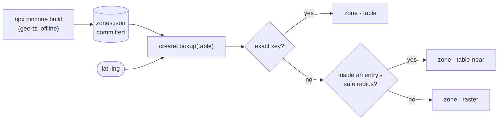

# pinzone

**The IANA timezone at a coordinate, exact where it matters, with no file reads at runtime.**

[](https://github.com/oo-pibe/pinzone/actions/workflows/ci.yml)
[](https://www.npmjs.com/package/pinzone)
[](https://bundlephobia.com/package/pinzone)
[](LICENSE)

Resolve your points once, offline, against the real timezone boundaries. Commit the answers as a small JSON table. At runtime `createLookup` reads that table, then a nearby entry, then a compact raster, and never touches the filesystem, which is what makes it safe inside a bundled serverless function.

```ts
import { createLookup } from 'pinzone';
import table from './zones.json' with { type: 'json' };

const zoneAt = createLookup(table);

zoneAt(65.8481, 24.1466); // { zone: 'Europe/Helsinki', source: 'table' }
zoneAt(40.4168, -3.7038); // { zone: 'Europe/Madrid',   source: 'raster' }
```

## Why

There are two good ways to turn a coordinate into a timezone in JavaScript, and each has a catch.

**[geo-tz](https://github.com/evansiroky/node-geo-tz) is exact.** It reads the real boundary polygons from about 30MB of data files on disk. A bundler doesn't carry those files, so inside a bundled function every lookup that needs them throws:

```
Error: ENOENT: no such file or directory, open
  '/var/task/node_modules/geo-tz/data/timezones-1970.geojson.geo.dat'
```

**[@photostructure/tz-lookup](https://github.com/photostructure/tz-lookup) reads no files.** It's 73KB of JavaScript and works anywhere. It's also approximate, and near a border the neighbour often keeps different clocks:

| Place | Coordinate | Raster says | Actually | Off by |
|---|---|---|---|---|
| Tornio, Finland | 65.8481, 24.1466 | Europe/Stockholm | Europe/Helsinki | 1 hour |
| Tabatinga, Brazil | -4.2527, -69.9381 | America/Eirunepe | America/Manaus | 1 hour |

At uniformly random points on land, the raster returns a zone with the wrong UTC offset for about **3% of the world**, 2.7% of North America and 1–2% of Europe. Your stadiums, stores or depots are a fixed list, so you can resolve them properly, once, and stop guessing.

**If none of your points are near a border, you don't need pinzone.** Use the raster on its own.

## How it works



Build resolves each point with geo-tz, then probes the ground around it on a ~10m lattice to find how far that zone holds. Those two facts, the zone and that radius, are all the runtime needs.

## Install

```sh
npm install pinzone
npm install --save-dev geo-tz   # only to build and check the table
```

Node 20.19+ or 22.12+. The published types work with TypeScript 5.0 and later.

## Quick start

**1. List your points** in a `.csv` with `lat` and `lng` columns, or a `.json` array of `[lat, lng]` pairs or `{ lat, lng }` objects. Extra fields are ignored.

```json
[[65.8481, 24.1466], { "name": "Wembley", "lat": 51.5561, "lng": -0.2794 }]
```

**2. Build the table and commit it.**

```sh
npx pinzone build points.json -o zones.json
```

```json
{
  "v": 1,
  "maxRadius": 250,
  "points": {
    "51.5561,-0.2794": ["Europe/London",250],
    "65.8481,24.1466": ["Europe/Helsinki",250]
  }
}
```

Each entry is the zone and how far it holds, in metres. A point on a border gets 0, so it answers only its own rounding cell.

**3. Use it.** Import the table so your bundler embeds it, and create the lookup once, at module scope.

```ts
const zoneAt = createLookup(table);

const { zone } = zoneAt(venue.lat, venue.lng);
const local = zone && new Intl.DateTimeFormat('en-GB', { timeZone: zone, timeStyle: 'short' })
  .format(new Date(fixture.utcKickoff));
```

**4. Keep it honest in CI.**

```yaml
- run: npx pinzone build points.json -o zones.json --check   # someone added a point but didn't resolve it
- run: npx pinzone check zones.json                          # boundaries moved, or the table was edited
```

## API

`createLookup(table, options?)` returns `(lat, lng) => Result`.

```ts
type Result =
  | { zone: string; source: 'table' | 'table-near' | 'raster' }
  | { zone: null; source: null };
```

- `table` is an exact key hit; `table-near` is inside an entry's safe radius and just as correct; `raster` means the fallback answered, so it's approximate; `null` means the input wasn't a coordinate, or nothing answered.
- The returned function **never throws**, whatever you pass it. A malformed table throws a `TypeError` from `createLookup` instead, when your function starts rather than mid-request.
- `options.fallback` swaps the raster for your own, or `null` turns it off. Importing from `pinzone/core` leaves the raster out of your bundle entirely.
- `pointKey(lat, lng)` gives the table key for a coordinate.

Full detail: [API reference](skills/pinzone/references/api.md) · [CLI reference](skills/pinzone/references/cli.md) · [setup guide](skills/pinzone/references/setup.md).

## CLI

```sh
pinzone build <points.json|points.csv> -o <zones.json> [--check | --refresh] [--max-radius 250]
pinzone check <zones.json>
```

`build` only adds points, never removes them, and leaves the file alone when there's nothing to add. Parallel builds of the same table are safe. `--check` reports missing points without writing, and without needing geo-tz. `--refresh` re-resolves every entry after a geo-tz upgrade. `check` re-probes the table against the boundaries you have installed.

Exit codes: `0` success, `1` a check found a problem, `2` bad arguments or input.

## Use with AI coding agents

pinzone ships an agent skill, [skills/pinzone/SKILL.md](skills/pinzone/SKILL.md), that teaches a coding agent the whole workflow: building the table, wiring up the lookup, CI, and what each warning means. It uses the open Agent Skills format, so one folder works across tools.

| Tool | Install | Checked |
|---|---|---|
| Claude Code | `/plugin marketplace add oo-pibe/pinzone`, then `/plugin install pinzone@pinzone` | Installed, and it loads itself when a task calls for it |
| Codex | `codex plugin marketplace add oo-pibe/pinzone`, then `codex plugin add pinzone@pinzone` | Installed; the skill reaches the model's prompt |
| Kimi Code | `/plugins install https://github.com/oo-pibe/pinzone`, then `/reload` | Manifest follows Kimi's documented format; not run end to end |
| Claude.ai | Zip the `skills/pinzone` folder and upload it in your skills settings | Same format; not uploaded |
| Anything else | `npx skills add oo-pibe/pinzone`, or copy `skills/pinzone` into `.agents/skills/` | Codex reads `.agents/skills/` |

The skill is inside the npm package too, at `node_modules/pinzone/skills/pinzone/`. For agents that read `AGENTS.md` instead, point them at it:

```md
## Timezones
This project resolves timezones with pinzone. Before changing zones.json or any timezone lookup,
read node_modules/pinzone/skills/pinzone/SKILL.md.
```

## What it promises

A `table` or `table-near` answer agrees with the boundary polygons, with two documented exceptions: inside a key's ~11m rounding cell the key's zone wins, and a piece of another zone smaller than the probe lattice can resolve (about 7m) can hide inside a radius. Anything larger is caught, because every stored radius keeps a fully probed ring beyond it.

`check` re-runs those probes against your installed geo-tz, so it catches stale entries, hand edits and moved boundaries. It can't catch what the probes were too coarse to see in the first place.

The rest, measured rather than asserted:

| | |
|---|---|
| Lookup | ~350ns from the table, ~480ns through the raster |
| Startup | 60ms and 15MB for a 30,000-point table |
| Build | ~2,200 geo-tz probes per point at the default radius |
| Runtime dependencies | one, the 73KB raster, or none via `pinzone/core` |
| Tests | 115, including a bundled run with file reads denied and a lookup checked against a brute-force scan |
| Also checked | differential fuzzing against geo-tz over millions of points, and mutation testing of the suite |

## Troubleshooting

### A lookup returns `{ zone: null, source: null }`

The input isn't a pair of finite numbers in range (strings like `'51.5'` don't count), or you're using `pinzone/core` or `fallback: null` and the point isn't in the table.

### A known point comes back with `source: 'raster'`

The committed table is missing it. Run `npx pinzone build <points> -o zones.json` and commit. `build --check` in CI stops it happening again.

### `build` warns that a key is within 10m of another zone

That point sits on a border, so its entry has a radius of 0 and its whole ~11m cell answers one zone. Nothing to fix unless the point belongs on the other side.

### `check` fails with `table says A, polygons say B`

The table was edited by hand, or geo-tz changed. Run `build --refresh` with the same `--max-radius`, then `check`, and read the diff before committing.

### Zone names changed after moving from geo-tz

geo-tz's default dataset merges zones that have kept the same clocks since 1970; pinzone uses the finer `geo-tz/all`. Baarle-Nassau comes back as `Europe/Amsterdam` rather than `Europe/Brussels`, with identical local times.

### TypeScript rejects `import table from './zones.json'`

Under `module: nodenext`, add `with { type: 'json' }` (TypeScript 5.3+) and `"resolveJsonModule": true`. Bundler setups accept the plain import.

### The function still fails with ENOENT after switching to pinzone

Something else reads a file at runtime, usually a data file loaded with `readFileSync`. Import it as JSON as well.

## FAQ

**Does this replace geo-tz?** No. It uses geo-tz at build time, where reading 30MB of polygons costs nothing, and keeps it out of your deployment.

**How big does the table get?** About 45 bytes per point, so 1,000 venues is roughly 45KB of JSON inside your bundle.

**What about daylight saving?** pinzone gives you the zone. The offset at a given moment comes from your runtime's own timezone database through `Intl`, so DST rules stay current without touching the table.

**Does it work in the browser?** The runtime does. Building the table needs Node and geo-tz.

**What if a place moves, or I delete one?** `build` adds and never removes. To prune, delete `zones.json` and build it again.

## Contributing

Bug reports are welcome, especially ones with a coordinate that gets the wrong answer. See [CONTRIBUTING.md](CONTRIBUTING.md), and [AGENTS.md](AGENTS.md) for how the code fits together.

## Origin

I built this for [Road to Kickoff](https://roadtokickoff.com), a football trip planner that shows every kickoff in the stadium's local time. Its scheduled data refresh ran in a serverless function, where geo-tz couldn't find its data files, and about a fifth of fixtures came back with no timezone, the same fixtures every run. A missing zone means a kickoff shown at the wrong hour, with nothing on the page to say so. The fix was to resolve the grounds offline, commit the answers, and fall back to a raster for anything new. This package is that fix, extracted.

## License

MIT
